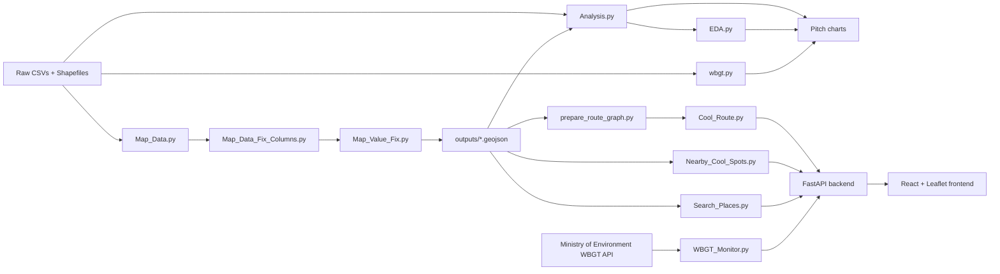

# Tokyo Cool Route 🌡️🚶

**A heat-safety companion for Tokyo's summer — helping people decide whether to go outside right now, and which way to walk if they do.**

Submission for the **Tokyo Metropolitan Government Open Data Hackathon 2026** (Governor's Cup) — Climate Change track.

---

## 🎥 Video Demo

https://github.com/user-attachments/assets/168045a6-7ad1-4100-9daf-6eb55080936a

---

## The Problem

Tokyo's summers keep getting hotter, and the city already publishes most of what's needed to cope with it — real-time heat index readings, cooling shelter locations, and green-space data. But none of it is connected to the actual decision a person makes standing on a hot street: **should I go outside right now, and if so, which way should I walk?**

Existing heat maps show conditions. Existing transit apps optimize for speed. Nobody combines the two into a single, actionable route.

Our end goal is a **Google Maps-style router built around heat, not just distance** — one that reads greenery, street-tree coverage, rivers/canals, and drinking-water stations the way a normal map reads roads, and turns that into a route with a time *and* a heat-exposure estimate attached, the way a transit app shows fare and duration.

## What We Built

Tokyo Cool Route matches all four objectives of the hackathon's Climate Change track:

### 1. Suggestions for nearby places to stay cool, and how to take breaks
- **Nearby Cool Spots** ranks parks, drinking-water stations, and convenience stores around any point, by walking distance and shelter quality.
- When the current WBGT reading crosses into Severe Warning / Danger, convenience stores (guaranteed air conditioning) are automatically boosted over open-air parks in the ranking — mirroring the real Japanese practice of pointing people at convenience stores as heat refuges on the worst days.
- A dedicated **Heatstroke Safety Guide** panel (reachable from the side tabs) walks through a prevention checklist and a mild → moderate → severe first-response decision tree, with a one-tap emergency call-out for severe cases.

### 2. Preventative action based on temperature, weather, age, and condition
- Live WBGT (Wet-Bulb Globe Temperature) readings pulled from the Ministry of the Environment's official real-time API, classified on the same 5-tier scale used in official guidance: *Almost Safe → Caution → Warning → Severe Warning → Danger*.
- **Age, pregnancy, and chronic-condition inputs shift the effective alert threshold one tier earlier** for people at higher heat risk — without ever inventing a custom risk score. Every guidance message traces back to the Ministry's own published thresholds (see *Important Notes* below).

### 3. Visualizing the impact of climate change
- 75-year annual temperature trend for Tokyo (1950–2024).
- Yearly count of "Danger"-level WBGT hours, to show how the number of genuinely dangerous hours is changing over time.
- A month × hour WBGT heatmap — when during the day and year the risk is actually highest.
- July–August WBGT compared year over year.
- First-frost-date trend, as a second line of warming evidence.
- All of it generated as presentation-ready charts for the pitch deck.

### 4. Visualizing local green spaces and cool spots
- Eight cleaned, English-labeled GeoJSON layers covering street trees, parks, protected green areas, public facility/housing greenery, water & canals, and drinking-water stations — built from Tokyo's GIS shapefiles and statistical yearbook CSVs.
- Ward-by-ward green-coverage %, street-tree density, and a "priority ward" chart highlighting districts that are weak on **both** parks and tree shade at once, where interventions would help the most.
- All of it rendered live on an interactive map.

### Our own stretch goals
- **I18n for tourists** — the entire UI (status card, guidance text, route labels, search) ships in English and Japanese, switchable with one tap.
- **Navitime-style routing** — inspired by Navitime and Tokyo's own heat maps, the app computes three walking-route alternatives (Fastest / Coolest / Recommended) instead of just one.
- **Heat cost at a glance** — every route shows distance, walking time, and a heat-exposure percentage in one line (e.g. *"300 m · 8 min · 62% exposed"*), the way a transit app shows fare and duration.

---

## How It Works



**Run order:** `Map_Data.py` runs first — it's the only source of the tree/green layers everything else depends on — followed by the two Pipeline B clean-up scripts (`Map_Data_Fix_Columns.py`, `Map_Value_Fix.py`). `Analysis.py` / `EDA.py` / `wbgt.py` handle the yearbook + chart side. `prepare_route_graph.py` runs once to pre-score the walking graph before the API starts, so route requests stay fast at runtime. A handful of supporting scripts (`Ward_Boundaries.py`, `OSM_Tokyo_Extract.py`, `OS_Crop_To_Tokyo.py`, `scripts/fetch_convenience_stores.py`) prepare the OpenStreetMap-derived layers (ward boundaries, the Tokyo-area extract, and convenience stores) that the routing and search layers read.

`WBGT_Monitor.py` is meant to run on a schedule (cron, Task Scheduler, or a GitHub Action) to keep `outputs/WBGT_Current_Status.json` fresh — that's the file the frontend polls for its live status banner.

---

## Data Sources

| Dataset | Source | Used for |
|---|---|---|
| WBGT (heat index), historical + live | Ministry of the Environment — Heat Stroke Prevention Information Site | Risk level, danger-hour charts, live status banner |
| Cooling shelters / "Cool Share" spots | Tokyo Metropolitan Heat Stroke Prevention Portal | Cool-spot ranking |
| Parks, protected green areas, street trees, water & canals, public facility/housing greenery | Tokyo Open Data Catalog Site (GIS shapefiles + statistical yearbook CSVs) | Map layers, route cooling score, green-coverage charts |
| Administrative ward boundaries | MLIT National Land Numerical Information (N03) | Ward-level aggregation, point-in-polygon checks |
| Convenience stores, walking network, POIs (schools, hospitals, stations, restaurants, …) | OpenStreetMap (via Overpass) | Cool-spot ranking, routing graph, place search |

Full provenance, retrieval dates, and licence terms: **[SOURCES.md](SOURCES.md)**.

© OpenStreetMap contributors (ODbL) — attribution required and shown in-app.

---

## Tech Stack

**Data pipeline / backend**
- Python 3.11+, pandas, GeoPandas, Shapely, pyproj
- OSMnx + NetworkX for the walking-network graph
- FastAPI + Uvicorn for the API
- rapidfuzz for fuzzy place-name search
- Matplotlib for the static charts
- boto3 for Cloudflare R2 (S3-compatible) storage

**Frontend**
- React + TypeScript + Vite
- Leaflet for the interactive map
- Tailwind CSS for styling
- A small custom i18n layer (English / Japanese)

**Infra**
- Raw + processed data hosted on Cloudflare R2
- Frontend deployable to Cloudflare Pages
- API deployable to Railway (`Procfile` / `railway.json` included)

---

## Project Structure

```
*.py                     Data pipeline & API scripts (see "How It Works")
csv/                     Raw yearbook CSVs (gitignored, pulled from R2)
<Category>/               Raw GIS shapefiles by theme (Water_Canals/, Street_Trees/, ...)
cleaned_data/            Cleaned CSVs + Analysis_*.csv + charts/ (gitignored, reproducible)
outputs/                 GeoJSON map layers, routing graph cache, pitch charts
web/                     Frontend (React + Vite)
web/src/                 App.tsx, MapView.tsx, SearchBox.tsx, i18n.ts, types.ts
web/public/data/         Lightweight GeoJSON the deployed app actually reads (committed)
tests/                   test_cool_route.py, test_wbgt_monitor.py
```

---

## Getting Started

### Requirements
- Python 3.11+
- Node.js 20+
- Shared R2 credentials (team only)

### Setup

```bash
git clone <repo-url>
cd Tokyo_Map_Cool_Route

# Python environment
python -m venv venv
source venv/bin/activate        # Windows: venv\Scripts\activate
pip install -r requirements.txt

# Credentials
cp .env.example .env            # fill in the values — never commit .env

# Pull raw data from R2
python fetch_raw.py --list      # see what's in the bucket first
python fetch_raw.py

# OpenStreetMap layers (convenience stores, walking network, POIs)
python scripts/fetch_convenience_stores.py

# Build the map layers (must run before Analysis.py / EDA.py)
python Map_Data.py
python Map_Data_Fix_Columns.py
python Map_Value_Fix.py

# Yearbook cleaning, ward analysis, and pitch charts
python Analysis.py
python EDA.py
python wbgt.py

# Pre-score the walking graph for fast routing
python Cool_Route.py --start 35.6909 139.7003 --end 35.6852 139.7100 --wbgt 28
python scripts/prepare_route_graph.py

# API (keep this terminal running)
uvicorn api:app --reload --host 0.0.0.0 --port 8000

# Frontend, in a second terminal
cd web
npm install
npm run dev
```

**Rule:** raw data in `csv/` and the GIS shapefile folders is never edited in place. Everything in `cleaned_data/` and `outputs/` must be fully reproducible by re-running the pipeline.

---

## API Reference

The FastAPI backend (`api.py`) exposes:

| Endpoint | What it returns |
|---|---|
| `GET /wbgt/status` | Latest official WBGT reading + risk tier |
| `GET /wbgt/personalized` | Same reading, re-classified for an age / pregnancy / chronic-condition profile |
| `GET /nearby-cool-spots` | Ranked parks, drinking stations, and convenience stores near a point |
| `GET /routes/walking` | Fastest / Coolest / Recommended walking routes between two points |
| `GET /search-places` | Fuzzy name search across 20+ place categories, for picking a destination |

---

## Important Notes

**This app does not make health judgements.** Risk levels and guidance text come straight from the Ministry of the Environment's published WBGT thresholds. Age and condition inputs only change *what's shown* and *when a break is suggested* — they never feed a custom, invented risk score.

**No personal data is collected.** No account, no stored age or condition data — inputs live only in the current session.

**Route weighting is a heuristic**, not a scientifically validated model. The cooling-score weights (tree proximity, park proximity, distance to water, and so on) are our own tunable estimates for this demo, not measured street-level temperatures.

---

## What's Next

- [ ] Replace the heuristic cooling weights with measured or modeled street-level temperature data, if it becomes available.
- [ ] Serve WBGT forecast data, not just the current reading.
- [ ] Expand the Heatstroke Safety Guide to more languages.
- [ ] Add offline / low-connectivity support for the map.

---

## Team

- **Alifian Naufal Ravi Hidayat** — [@corexaltdev](https://github.com/corexaltdev)
- **Ashwin Pandey** — [@ashwin2201](https://github.com/ashwin2201)
- **Tausif Ibne Iqbal** — [@Tausif30](https://github.com/Tausif30)

## Licence

The code in this repository is released under the **MIT Licence** — see [LICENSE](LICENSE) for the full text.

This covers the code only. Each dataset keeps its own original licence and attribution requirements — see **[SOURCES.md](SOURCES.md)**, and note that the OpenStreetMap-derived layers are ODbL and require the © OpenStreetMap contributors attribution shown in-app.

## Acknowledgments

Built for the **Tokyo Metropolitan Government Open Data Hackathon 2026**. Thanks to the Ministry of the Environment, the Tokyo Open Data Catalog, MLIT, and the OpenStreetMap community for making this possible.
